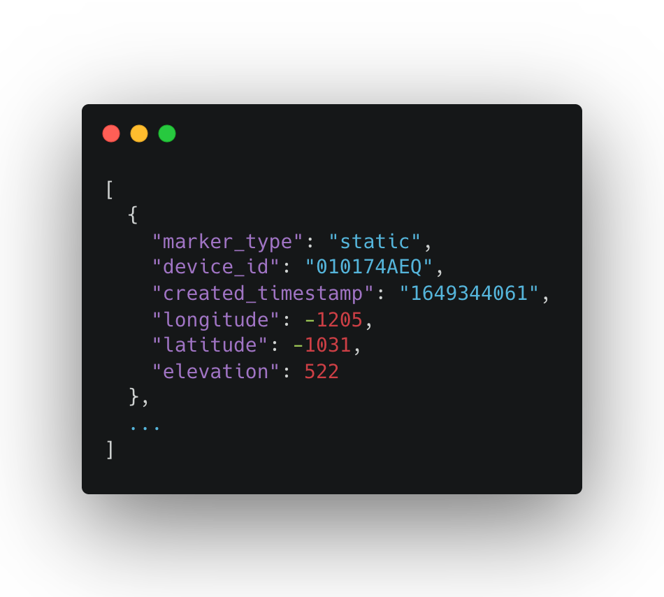
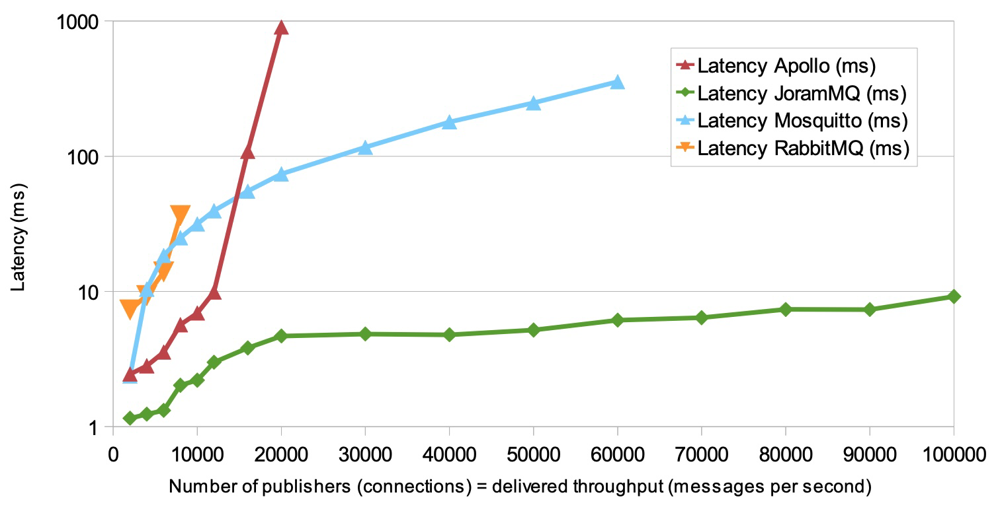

# Mojexa Spaces Project


Kai Hirota

kaiyhirota@gmail.com

https://www.linkedin.com/in/kaihirota/


## Table of Content

[toc]

---

## Summary

The North Star of the project was to design and develop the necessary components in C++ to enable representation of temporal geolocation data, both static and dynamic, in Unreal Engine. 


The final deliverable is composed of the following items:

- `SpacesMarkerManager`: All of the features packaged as an Unreal Engine plugin. [Repository Link](https://github.com/from81/SpacesMarkerManager)
- `MojexaSpacesSampleProject`: Example project that demonstrates how to use the above plugin in Blue Print Visual Scripting language. [Repository Link](https://github.com/from81/MojexaSampleProject)
- `MojexaSpacesSampleProjectC`: Example project that demonstrates how to use the above plugin in C++. [Repository Link](https://github.com/from81/MojexaSampleProjectC)
- `MojexaSpacesInfra`: Collection of Python and shell scripts. [Repository Link](https://github.com/from81/MojexaSpacesInfra)
	- `dynamodb/`
		- Docker compose file for deploying DynamoDB instance on a local machine for development and demonstration purpose.
		- Readme.md contains shell commands used for creating, deleting, and inspecting DynamoDB, which can be used for either development or production DynamoDB instance. Requires python 3 and  `aws` CLI to be installed.'
		- `dynamodb_helper.py` Python script for generating random location data. Can be used to mimic static markers as well as dynamic markers.
	- Miscellaneous:
		- `spaces_api/`
			- AWS Lambda handlers written in Python to quickly mimic Mojexa / Tiparra's REST API. Includes endpoints for Create / Read / Delete. The project used these API endpoints in the beginning, and later switched to using AWS-SDK directly to interact with DynamoDB table. The script has not been maintained nor updated after that.
		- `lambda_publish_location`
			- AWS Lambda handler which acts on all inserts to DynamoDB by monitoring DynamoDB Streams. Whenever there is an insert, this function will publish the newly inserted row to AWS RabbitMQ broker. Since no MQTT / RabbitMQ client libraries are available in C++ in Unreal Engine context, this approach was discontinued. However, the Lambda function does what it is supposed to.

## Get Started

For set-up instructions, see [this documentation](https://github.com/from81/SpacesMarkerManager/tree/main).

## Dependencies and Assumptions

### **Dependencies & Requirements**

- Unreal Engine $\ge$ 5.0
- Dependency Plugins
	- [awsSDK by Siqi Wu](https://www.unrealengine.com/marketplace/en-US/product/aws-dynamodb)
	- [CesiumForUnreal](https://github.com/CesiumGS/cesium-unreal)
- Docker required if running DynamoDB locally

### Assumed DynamoDB schema

Note: The name of each attribute of a location data is parametrized as a configuration variable in `Settings.h`. Therefore the attribute names do not matter. What matters is the data types and the schema.

- Partition Key: `device_id`: String
- Sort Key: `created_timestamp`: String, UNIX Timestamp format
- Longitude / Latitude / Elevation: Number



```shell
# remove "--endpoint-url http://localhost:8000" if running against production DB
# create table with Stream enabled
aws dynamodb create-table --region=ap-southeast-2\
    --table-name mojexa-markers\
    --attribute-definitions\
        AttributeName=device_id,AttributeType=S\
        AttributeName=created_timestamp,AttributeType=S\
    --key-schema AttributeName=device_id,KeyType=HASH AttributeName=created_timestamp,KeyType=RANGE\
    --provisioned-throughput ReadCapacityUnits=1,WriteCapacityUnits=1\
    --stream-specification StreamEnabled=true,StreamViewType=NEW_IMAGE\
    --endpoint-url http://localhost:8000

# delete table
aws dynamodb delete-table --table-name "mojexa-markers" --endpoint-url http://localhost:8000

# count rows in a table
aws dynamodb scan --table-name "mojexa-markers" --select "COUNT" --endpoint-url http://localhost:8000

# insert item
aws dynamodb put-item --table-name "mojexa-markers" --endpoint-url http://localhost:8000\
    --item \
        '{"device_id": {"S": "terminal"},
        "marker_type": {"S": "static"},
        "created_timestamp": {"S": "1650500000"},
        "elevation": {"N": "235.98500099279516"},
        "longitude": {"N": "-585.3850629978563"},
        "latitude": {"N": "1257.8828626888426"}}'
```

Why this schema? Why not use a list of map containing coordinates and the timestamp?

- To query any DynamoDB table, you need a partition key and sort key.
- While using a list of map makes sense, it is not possible to simply retrieve the first or last item in a list in DynamoDB. You must retrieve the whole item / row. Using a list of map means when we poll for new locations we are retrieving more duplicate data in each request, which consumes more read capacity units.
- You would need a mechanism to ensure that the list is always sorted in the correct order.
- Querying gets much more complicated, as you can't retrieve a set of coordinates given a coordinate range.
- Any other attribute that is added - for example, the quantity, and price of the items the customer purchased at some kiosk at a given location and time, need to be stored in a list as well, since you will only have device id as the partition key but no timestamp to use as sort key. This makes querying harder, as it is not possible to create indexes on nested elements in DynamoDB. You also will not be able to do aggregations unlike using relational databases.

Why using a flat schema (each row has id, timestamp, and coordinate x y z) makes sense

- It's possible to create to collapse the x-y coordinates into a single string through geohashing, which can then be indexed and range-queried against. This is also a good candidate for global or local secondary index. 
- Using geohash as the range key or partition key will mean that records in the same partition are geographically close to each other.
- Each row / item is as small as it can be, so it consumes less read capacity unit.
- Checking if a given device ID has a new location requires us to check only one document -  by traversing the timestamp in reverse.
- Other attributes that do not change over time should be stored separately - for example, in a relational database where you can have strong consistency. Using the same device ID as the primary key.
- Using this architecture, you can flexibly add and change the attribute at any time.
- This is the only schema currently that allows you to say, 

### **Assumption around Marker behaviors**

A single unit of timestamped geolocation data can be represented and instantiated as a `LocationMarker`, which has 3 types, each being a parent class of the next:

- Static: A green sphere fixed in space and time. Once instantiated, it will continue to exist until explicitly destroyed by the player, or the game shuts down.
- Temporary: A blue sphere fixed in space. Once instantiated, it will continue to shrink at a constant rate, and self-destruct after 30 seconds.
- Dynamic: A purple sphere that represents some dynamically moving object or edge device. It moves over time to represent the real-world movement. Once it reaches the final stop, it will begin self-destruct timer, which is also set to 30 seconds.

## Design


### Location Markers

All of the Marker classes are designed to be Blueprint extensible and assignable, and most of the core functions and attributes are exposed as Blueprint callable functions with appropriate Read/Write access control for memory safety. 

All of the markers use something called Dynamic Material Instance, and all three markers use the same dynamic material instance. That means from the perspective of Unreal Engine, there is only one material. The material is parametrized and dynamic, allowing the user to change the color, and opacity in-game, dynamically. When new markers are spawned, no new material instances are created; instead, they are copied with updated color and opacity values. This also shortens the memory usage and speed of when spawning markers.

### `Dynamic Markers`

The main and the most complex class to develop was the Dynamic Marker. Internally, it maintains a priority queue of `FLocationTs` objects, each one containing a timestamp and WGS84 coordinate, which is reprojected onto Unreal Engine and Earth-Centered Earth-Fixed coordinates and stored during initialization. When it reaches the final location and eventually self-destructs, it will invoke a delegated function `UMarkerManager::DestroyMarker()` to clean up after itself.

### `FLocationTs`

`FLocationTs` is the struct (`UStruct`), or "data class", which wraps around timestamp and location data. Every type of marker listed above holds one instance of `FLocationTs` which represent the location of that marker at current time stamp. 

- A Dynamic Marker maintains a priority queue of `FLocationTs` objects to represent the historical locations in chronological order.  
- Using priority queue comes at a slight cost, with time complexity of insertion and deletion being $O(\log n)$. 
- By paying the small cost, we can guarantee that the route each Dynamic Marker travels on is chronologically accurate, even if location data is received by the client out-of-order. 
- `FLocationTs` is designed to be immutable for safety. Using `UStruct` instead of storing timestamp and coordinate directly in Location Marker has the benefit of lower construction cost, smaller memory footprint, and improvement in handling and moving the data.

```c++
// Being a data class, FLocationTs is designed to be immutable to maintain data integrity and mapping between the 3 coordinate reference systems.
// To update, simply create a new FLocationTs with new coordinates.
UPROPERTY(VisibleAnywhere, BlueprintReadOnly, Category="Spaces|Util")
FDateTime Timestamp;

UPROPERTY(VisibleAnywhere, BlueprintReadOnly, Category="Spaces|Util")
FVector Wgs84Coordinate; // the "normal" GPS coordinate

UPROPERTY(VisibleAnywhere, BlueprintReadOnly, Category="Spaces|Util")
FVector UECoordinate;
 
UPROPERTY(VisibleAnywhere, BlueprintReadOnly, Category="Spaces|Util")
FVector EcefCoordinate; // Used by Cesium
```

### `MarkerManager`

Marker Manager class is the center-piece of the project and the plugin. It is used an interface to creating, fetching, and deleting location markers. It can also be used to do a "Replay" and "Listen" to DynamoDB Streams. 

- It is implemented as a `UGameInstance`, which is a singleton that guarantees there is always one instance. As a GameInstance, it is automatically created when the game starts, and destroyed and cleaned up appropriately when the game ends.
- Major benefit of extending `UGameInstance` is that the Marker Manager is callable and accessible from anywhere, which is not a simple task in multithreaded game environment. And you always get the same instance.
- Caveat of using `UGameInstance` is that you cannot use other `UGameInstance` since there can only be one. In such case you can combine them into one `UGameInstance` or convert them to `UGameInstanceSubsystem`.

Internally, the Marker Manager holds a hash map named `SpawnedLocationMarkers`, which is a key-value store that maps each unique Device ID to a pointer that points to the `LocationMarker`, for all location markers that have been spawned and have not been destroyed. Downside of using `TMap` data structure is that it cannot be exposed as a Blueprint variable, making it inaccessible to Blueprint users. This is solved by adding a function to generate a `TArray` of Location Markers that can be called from Blueprint. Using a hashmap as opposed to `TArray` comes with significant improvement lookup time and reduction in memory usage, as it does not require contiguous memory space; by nature of hashmaps, it only store unique Device IDs. This works well with Dynamic Markers because an instance of DynamicMarker is assumed to be associated with a specific DeviceID. When the Marker Manager listens to DynamoDB Streams or does a Replay and receives new location data, it will check if a Dynamic Marker with the same DeviceID exists. If it does not exist, new instance will be spawned and initialized. Otherwise, it will pass the new location data to the already spawned Dynamic Marker to be enqueued.

```c++
TMap<FString, ALocationMarker*> SpawnedLocationMarkers;
```


#### Replay

The replay capability of Marker Manager takes advantage of DynamoDB Streams' built-in feature, which records all modifications for 24 hours. The specifics of how this works is documented [here](https://github.com/from81/MojexaSpacesInfra/tree/main/dynamodb) in the "Note" section at bottom. The replay function, once invoked, will iterate through DynamoDB Streams records, and pull all the insertions to DynamoDB into Unreal Engine and spawn Dynamic Markers.

```c++
/**
 * Given a DynamoDB table, which may be associated with one or more streams,
 * replay all the insert events in the last 24 hours.
 * Internally this calls ScanStreams() on each Stream associated with a given table.
 * @param TableName
 **/
UFUNCTION(BlueprintCallable, Category="Spaces|MarkerManager")
void DynamoDBStreamsReplay(FString TableName);
```

**Performance**: Even with 100 Dynamic markers sending location data every 2 seconds, there is no noticeable lag of any kind.

**Test**: To test replay, open `MojexaSampleProjectC` in Unreal Engine, and press `P`.

**Demo**: [Link](https://www.loom.com/share/c90a379a724a4e448e7a5f47e9009326)


#### Listen

 The replay feature uses the `LATEST` shard iterator. The `LATEST` shard iterator is one of the ways in which a client can iterate through DynamoDB Streams. When the client sends a request for `LATEST` shard iterator to AWS, AWS internally creates an iterator, and returns the ID of the iterator to the client. `LATEST` shard iterator means that it will contain any records inserted from the moment the `LATEST` shard iterator is created, until the subsequent `GetRecords` request is sent to DynamoDB Streams, in chronological order. It is important to note that, in contrary to my initial assumption, DynamoDB Streams does not have the ability to let you subscribe to updates. `DynamoDBStreamsListen()`, the method used for Replay creates a `LATEST`  s hard iterator, then sends the `GetRecords` request `PollingInterval` seconds later, and also creates another `LATEST` iterator, and repeats the 2 steps until the replay function is invoked again.

```c++
/* Length between each successive call to DynamoDBStreamsListen() */
UPROPERTY(BlueprintReadOnly, EditDefaultsOnly, Category="Spaces|MarkerManager")
double PollingInterval = 2.0f;

/**
 * Start polling DynamoDB Streams at interval specified by PollingInterval.
 * Call this method to begin / end listening to the Streams.
 * Internally it uses DynamoDBStreamsListenOnce().
 * Table name must be configured in Settings.h.
 **/
UFUNCTION(BlueprintCallable, Category="Spaces|MarkerManager")
void DynamoDBStreamsListen();
```

**Performance**: At 50 dynamic markers sending location data every 2 seconds, the UI freezes for a fraction of second every time there is a fetch. If the player is not moving, it's not noticeable.

**Test**: To test replay, open `MojexaSampleProjectC` in Unreal Engine, and press `L`.

**Demo**: [Link](https://www.loom.com/share/13be2206d3ca461f84ef960348e4c105)


## Infrastructure


The project took into account the existing infrastructure of Mojexa / Tiparra, and utilized DynamoDB Streams. Since DynamoDB is a key-value store, we cannot simply ask for the last inserted row. We must provide the `device_id` and `created_timestamp` to retrieve the row. Scanning the whole table would be equivalent to using DynamoDB as a RDBMS. In search of alternative, DynamoDB Streams was the best option. DynamoDB Streams integration began based on the assumption that it will allow us to "listen" to real-time updates, which was not exactly the case. This finding was discovered during the 2-week break half-way through the project timeline. An attempt to replace the usage of DynamoDB Streams with another system, AWS RabbitMQ, was made. However, I came to find out that there are no client libraries available to be used to interact with MQTT / RabbitMQ from C++ and in Unreal Engine environment, so this alternative was discontinued.

## Further Development

### Caveats and ToDo's

1. AWS credentials should be converted to configuration variables in `.ini` file. Because `SpacesMarkerManager` is a UE plugin, it cannot have it's own dedicated config file. However, plugins can still read from the project-level config file.

2. Initially, I planned to integrate `CesiumForUnreal` into the plugin as well. However, there wasn't enough time left to do this after finishing all of the other core features. With little time I had, I added a `CesiumGeoReference` variable to the `UMarkerManager` class. If `UseCesiumGeoreference` is set to True in `Settings.h` file, the coordinates received from DynamoDB is treated as WGS84 coordinate. When `FLocationTs` is created by `UMarkerManager::WrapLocationTS()`, the WGS84 coordinate will be projected to UE coordinate and Earth-Centered Earth-Fixed coordinate reference system like below:

	```cpp
	FLocationTs UMarkerManager::WrapLocationTs(
	    const FDateTime Timestamp, const double Lon, const double Lat, const double Elev) const
	{
		FVector InGameCoordinate, EcefCoordinate, Wgs84Coordinate = FVector(Lon, Lat, Elev);
		if (this->Georeference && UseCesiumGeoreference)
		{
			const glm::dvec3 UECoord = this->Georeference->TransformLongitudeLatitudeHeightToUnreal(glm::dvec3(Lon, Lat, Elev));
			InGameCoordinate = FVector(UECoord.x, UECoord.y, UECoord.z);
	
			const glm::dvec3 EcEfCoord = this->Georeference->TransformLongitudeLatitudeHeightToEcef(glm::dvec3(Lon, Lat, Elev));
			EcefCoordinate = FVector(EcEfCoord.x, EcEfCoord.y, EcEfCoord.z);
			return FLocationTs(Timestamp, InGameCoordinate, Wgs84Coordinate, EcefCoordinate);
		} else
		{
			return FLocationTs(Timestamp, Wgs84Coordinate, FVector::ZeroVector, FVector::ZeroVector);
		}
	}
	```

	Since there wasn't enough time to test the behavior, `UseCesiumGeoreference` is set to `False` in the example projects. If the feature does not work as intended, `UMarkerManager` can be Blueprint extended, and the functions can be overridden.

### Extending the classes or adding new attributes

To add new features or functionalities, one can either continue working from the C++ code in the plugin, or extend the C++ classes in the plugin by Blueprint, since the classes are Blueprint extensible and assignable.

In the delivered UE plugin, each location marker is assumed to only need the timestamp, coordinate, and device ID information. If there are other attributes in DynamoDB, it will not be read. Due to the statically typed nature of C++, enabling location markers to accept any number of attributes with unknown data type required more time than how much time was left after implementing all of the other features. To add new attributes, `UMarkerManager::ProcessDynamoDBStreamRecords()` and `UMarkerManager::GetLatestRecord()` functions need to be updated.

### Scaling Up

The project began with an ambitious goal of streaming tens of thousands of data units per second.

To reach this level of scalability and throughput, there are mainly 2 challenges: storage, and delivery of messages.

#### Delivery

To receive and consume location data from thousands of devices in real-time, whether at fixed or sporadic interval, the system (the game) needs an intermediate storage system so that the game client can pause and resume consuming messages without missing or dropping messages. For this kind of problem, publisher/subscriber systems that use the MQTT protocol, such as Mosquitto or RabbitMQ can work. For both of them, there is one "broker" that receive messages from producers and return them to consumers. Clients can publish messages with different levels of guarantee called "QoS level". QoS 1 guarantees every message is received by the consumer at least once, while QoS guarantees exactly-once delivery at cost of throughput. Either way, this system would easily scale beyond 1000 messages per second, as shown by publicly available benchmarks, such as this one:



Source: http://www.scalagent.com/IMG/pdf/Benchmark_MQTT_servers-v1-1.pdf

The strength of using MQTT-based system is that MQTT is the most ubiquitous IoT protocol and work well with mobile, IoT, or embedded devices with low resources in terms or memory or connection bandwidth. It's also easy to deploy, and can be deployed in many ways. One can easily get an AWS EC2 instance, and set up a broker.

The major downside of MQTT-based system is that no matter how powerful the server is, it is still a single-server system, which lacks fault tolerance and horizontal scalability of memory and storage. MQTT systems stores all of the messages in memory. As such, it requires vertical scaling and careful selection of the virtual machine tier in terms of storage and compute power upfront. Due to the need for vertical scaling and being on one machine, there will likely be diminished return in performance gains in the long run, with respect to the marginal cost of upgrading to the next tier. If storage fills up while the broker is in service, messages stored in memory can be lost.

While the attempt to integrate AWS RabbitMQ into Mojexa Spaces was discontinued, the decision to discontinue was in part due to the fact that the whole project had to be done in 12 weeks, and there was too much uncertainty around MQTT, and not worth the risk of jeopardizing the DynamoDB Streams integration, which was also in progress at the time. However, with the arrival of UE5, I am certain that developers and companies will develop more UE plugins, especially around MQTT or pub/sub systems in general. In my research, I saw many people express the need to consume messages within UE from external producers, and frustration due to the lack of adequate solution.

#### Storage

To address the downside of MQTT systems, Apache Kafka or Kinesis Data Stream would be great alternatives that can provide even more performance. While it requires more work upfront in terms of deployment, resource acquisition and allocation, both Kafka and Kinesis can provide significantly higher throughput, with better fault tolerance and horizontal scalability.

The major difference between these two, and MQTT systems, is that Kinesis and Kafka are distributed pub/sub systems running on commodity hardware. Storage and throughput can be scaled much more flexibly. Kinesis Data Streams is able to read messages from DynamoDB Streams and store events for up to a week, and is also easier to use, since the library and SDK for Kinesis is more high-level than DynamoDB Streams, and the user doesn't have to fiddle with partitions and shards as much as they do with DynamoDB Streams.

Since both Apache Kafka and Kinesis Data Stream are more modern and cloud-native, there may be already work in progress to make it accessible from Unreal Engine. There may also be other plugins that provide access to Kinesis module of the AWS SDK.

### Optimizing cost

When using DynamoDB and DynamoDB Streams, doing any kind of scans should be avoided as much as possible to reduce the amount of reading (as well as retrieval speed). Like described in a previous section, [Assumed DynamoDB schema](#Assumed-DynamoDB-schema), using device ID as the partition key and timestamp as the sort key is a good choice of schema. The reason is that if we want to check if a given device ID has a new location, we can traverse the partition in reverse direction, which means we only need to look at one document or row. If we want to retrieve data without specifying the device ID, it is best to offset the read to DynamoDB Streams where possible.

If we decide to use MQTT or some distributed pub/sub system, we can use the AWS Lambda function to select insert events from DynamoDB Streams, and publish those events to the broker. Using AWS Lambda to read from DynamoDB Streams is **free**, unlike using the `aws-sdk` to read from the Stream.

## Cost

### Cost Structure

- DynamoDB

	- $0.2846 per million read request unit for **items up to 1KB** per month

- DynamoDB Streams

	- Every month, the first 2,500,000 DynamoDB Streams read request units are free
	- $0.0228 per 100,000 DynamoDB Streams read request units thereafter
	- Data from DynamoDB Streams is read using GetRecords API call. Each of these calls is billed on RRU basis and **returns up to 1MB of data**. Stream RRU are independent from Table RRU.

- Implication

	- Reading from DynamoDB Streams is cheaper per RRU, and is able to get around 1000 times more data per RRU (1MB as opposed to 1KB).

	- As an example, one row (like below) is 214 bytes.

		```json
		{
		    "device_id": {"S": "terminal"},
		    "marker_type": {"S": "static"},
		    "created_timestamp": {"S": "1650500000"},
		    "elevation": {"N": "235.98500099279516"},
		    "longitude": {"N": "-585.3850629978563"},
		    "latitude": {"N": "1257.8828626888426"}
		}
		```

### Estimated Monthly Infrastructure cost

- Assumptions
	- Eventual consistency suffices, no need to strong consistency.
	- Pricing model: On-demand (as opposed to provisioned)
		- On-demand is better for unpredictable workloads.
	- Read-to-write ratio: 5:1
- Scenario: 100 messages delivered every second for a period of 4 hours, 20 weekdays in each month
	- DynamoDB
		- Monthly Writes: 100 msg/sec * 60 sec * 60 min * 4 hr * 20 days = 28,800,000 WRUs (Write request units)
			- 57,600,000 Eventually consistent writes or 28,800,000 strongly consistent writes per month
			- $409.85 per month
		- Monthly Reads: WRU * 5 = 1,440,000,000 RRUs (Read request units)
			- Multiply by 2 to get eventually consistent reads.
			- $410.40 / month
		- 25GB of data stored in DynamoDB table: $7.12 / month
	- DynamoDB Streams
		- Assuming same number of reads made to DynamoDB and DynamoDB Streams: 1,440,000,000 RRUs (Read request units)
		- $328.32 per month
	- Estimated Monthly Infrastructure cost: 1155.70 USD per month
		- 57.6 million eventually consistent writes, or 200 messages sent every second for 4 hours, 20 days a month.
		- 2.88 billion eventually consistent reads.
		- Since DynamoDB Streams is able to fetch 10 times more data per read request unit, it requires much less reads. So shifting read loads to DynamoDB Streams will further decrease cost.